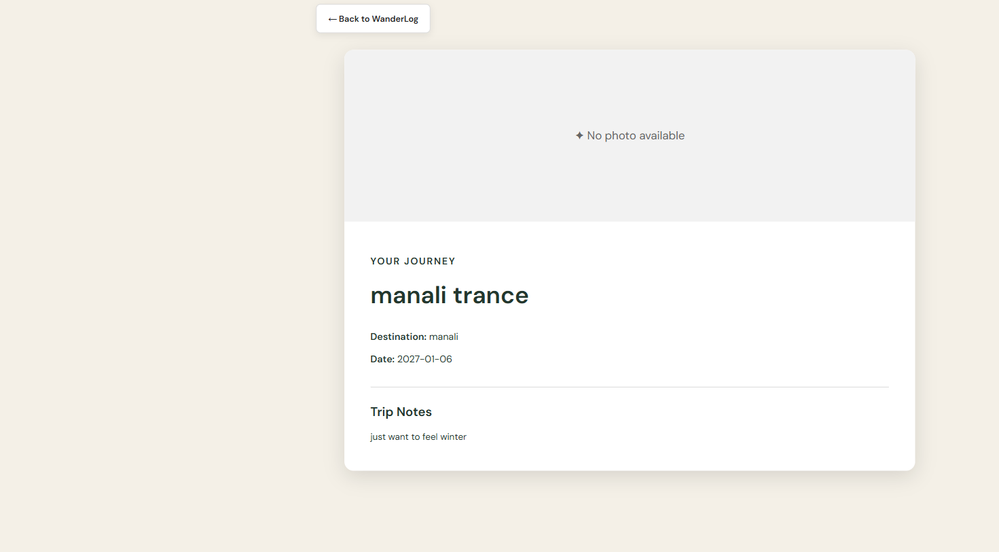
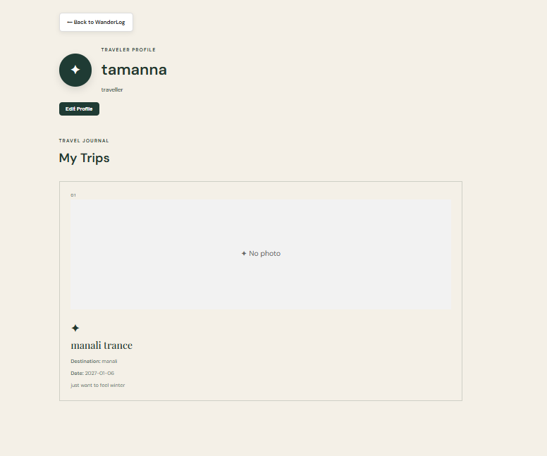

# Wanderlog ✈️

Wanderlog is a simple travel journal website where users can create, view, edit, and delete their travel stories. Users can also add trip cover photos and create a public traveler profile.

## Features

- Add new trips
- View saved trips
- Edit existing trips
- Delete trips
- Add trip cover photos
- Preview photos before saving
- Store trip data using localStorage
- View detailed trip pages
- Create and edit a traveler profile
- Shareable public profile URL
- Responsive design for desktop, tablet, and mobile
- Form validation and friendly error messages

## Tech Stack

- HTML5
- CSS3
- JavaScript
- LocalStorage
- FileReader API
- Git & GitHub

## How to Run Locally

1. Clone this repository.
2. Open the project folder in VS Code.
3. Install the Live Server extension.
4. Right-click `index.html`.
5. Select **Open with Live Server**.
6. The Wanderlog website will open in your browser.

## Project Structure

```text
WonderLog/
├── index.html
├── style.css
├── script.js
├── trip.html
├── trip.js
├── profile.html
└── profile.js
```

## Screenshots

### Home Page


### Trip Details

### Traveler Profile


## Deployment

## 🌐 Live Demo

🚀 [Visit WanderLog](https://wanderlog-codgen.vercel.app/)

The project is deployed and available online using Vercel.

## Repository

https://github.com/khanak24pardeshi/WanderLog
